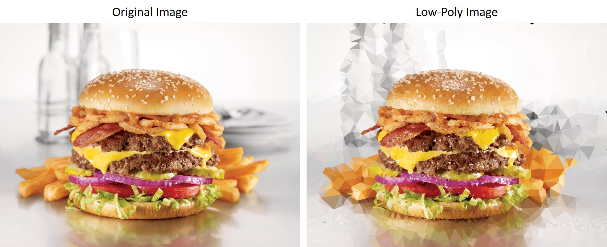
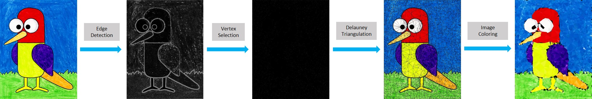
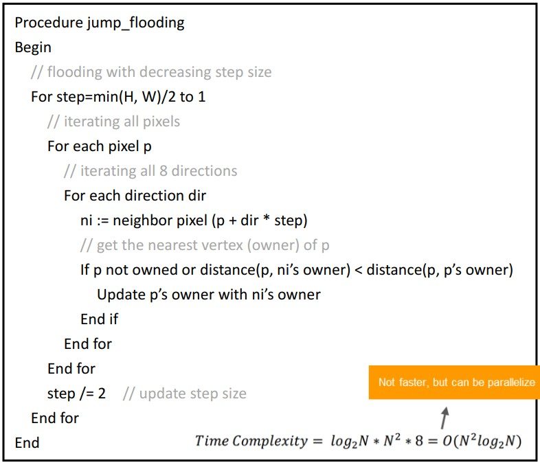
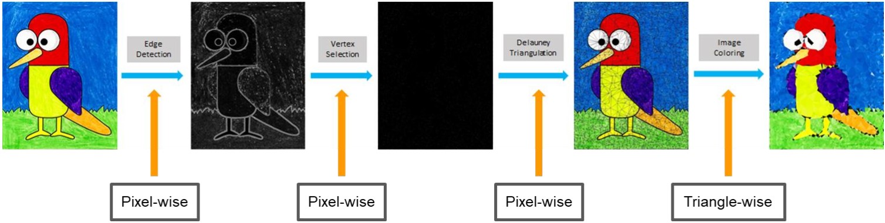
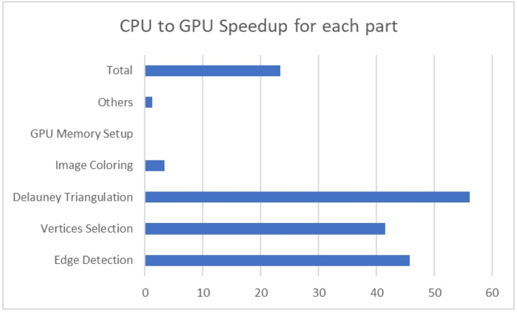
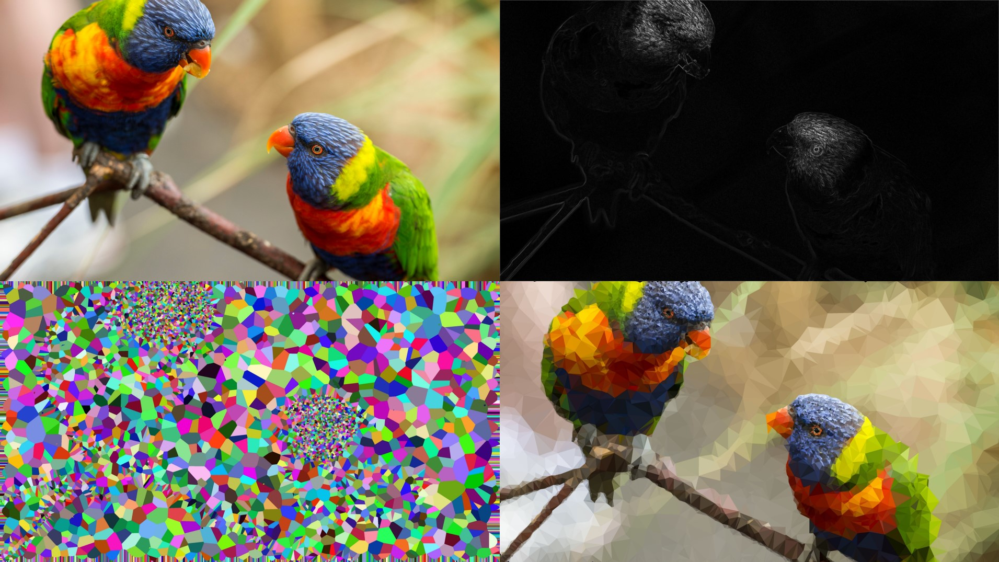
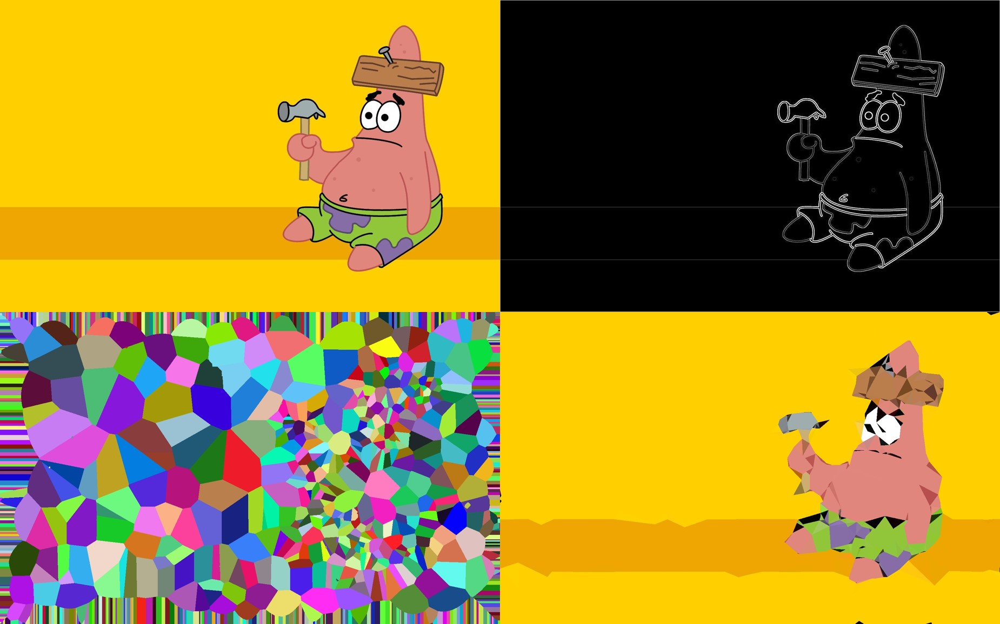

# Parallel-Low-Poly-Image

## Project Intro :dart:

Low-poly style image is an image represented by finite number of polygons, and it was commonly used in computer graphics in the early stage due to the limitation in computational resources. Meanwhile, low-poly style image also comes to an application in artwork, it can be seen as a simplicity transformation of a real world image. In this project, I implemented the whole process of generating a low-poly style image in sequential manner. After that, I parallelized it with CUDA library and analyzed the performance improvement in each part of the process.

## Implementation

According to ***Low-poly style image and video processing[1]***, the process can be divided into four stages: **(1) Edge Detection (2) Vertex Selection (3) Delauney Triangulation (4) Image Coloring**. The idea of this method is sampling vertices using detected edges as a prior in order to preserve the geometry appearance of an image. Then, `delauney triangulation` is performed to generate triangles from the previous sampled vertices. Finally, we color the image based on the generated triangles.

Note that common algorithms on solving delauney triangulation, such as `Lawson's Flip Algorithm` and `Bowyer-Watson Algorithm`, are not easy to be parallelized since they have dependency between each operation. Therefore, we utilize a nice property of delauney triangulation that **voronoi diagram is dual graph of delauney triangulation given a discrete point set P**. In this way, we can generate voronoi diagram at first then convert it into delauney triangulation. According to ***Jump flooding in GPU with applications to Voronoi diagram and distance transform[2]***, voronoi diagram can be potentially processed in parallel via jump-flooding algorithm.

## Parallelization

Here are some of the optimization I have done in this project:
* Random state initialization speedup in CUDA
* Use `Thrust Library` for computing prefix sum
* Jump flooding in 2D GPU configuration to get better flooded result
* Use `Sort-by-key` on triangles area to avoid load balance issue

## Quantitative Results

## Qualitative Results

For more implementation details, please check the [project report](https://github.com/MaxHsu88/Parallel-Low-Poly-Image/blob/main/supplement/report.pdf) and [project demo slides](https://github.com/MaxHsu88/Parallel-Low-Poly-Image/blob/main/supplement/slides.pdf).

## How to use it?

1. Use `make` in either `source/GPU` or `source/CPU`
2. Executable file `Solver` will be generated
3. `./Solver {input image filename} {output image filename}`

** Note that image file is restricted to `.jpg` format!!!

## Software Requirements

* OpenCV 3.4.3
* CUDA V11.0
* g++ (GCC) 10.1.0

## Hardware Settings

* CPU: Intel Xeon X5670 (2.93GHz)
* Memory: 64GB

## Reference

### Paper:

* [1] Zhang, W., Xiao, S., & Shi, X. Low-poly style image and video processing. 2015 International Conference on Systems, Signals and Image Processing (IWSSIP)

* [2] Guodong Rong, Tiow-Seng Tan. Jump flooding in GPU with applications to Voronoi diagram and distance transform. Proceedings of the 2006 symposium on Interactive 3D graphics and games (ACM)
